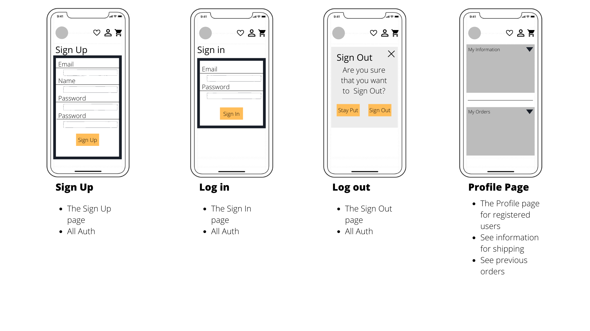

# E.Stromlind Art (ESART)
Intro paragraph
amiresponisive image
## User Stories

* As a Shopper, I want to get an overview of all the products.
* As a Shopper, I want to be able to see poster all the posters depending on the poster's motive.
* As a Shopper, I want to be able to view a product detail for each product on the page. 
* As a Shopper, I want to be able to like different posters/products and see them on my user page.
* As a Shopper, I want to be able to request a customized poster.
* As a Shopper, I want to be able to create a user profile page for smoother checkouts and be able to edit information when needed.
* As a Shopper, I want to be able to see my order history on my user page.
* As a Shopper, I want to be able to manage the shopping cart by adding, editing, and deleting products in the bag.
* As a Shopper, I want to get confirmation that it went through after purchase.
* As a Shopper, if something goes wrong during the shopping process, I want to get a notification about it.
* As a Store Manager, I want to be able to manage products through the admin page.

## UX (briefly explain your design)
### Colour Scheme (explain your colors, etc.... perhaps use coolors.co?)
### Typography (explain any fonts and icon libraries used, font-awesome/google fonts, etc)
#### Fonts

#### Icons
For this project, the different icons for the navbar are:
* [hamburger-menu](https://fontawesome.com/v5/icons/align-justify?s=solid)
* [search](https://fontawesome.com/v5/icons/search?s=solid)
* [heart](https://fontawesome.com/v5/icons/heart?s=regular)
* [user](https://fontawesome.com/v5/icons/user?s=regular)
* [shopping-cart](https://fontawesome.com/v5/icons/shopping-cart?s=solid )

, for the pages, like poster-detail.html are: 
* [heart-regular](https://fontawesome.com/v5/icons/heart?s=regular)
* [heart-solid](https://fontawesome.com/v5/icons/heart?s=solid)
* [arrow-left](https://fontawesome.com/v5/icons/angle-double-left?s=solid)

And for the footer:
* [facebook-icon](https://fontawesome.com/v5/icons/facebook-f?s=brands)
* [instagram-icon](https://fontawesome.com/v5/icons/instagram?s=brands)
* [pinterest-icon](https://fontawesome.com/v5/icons/pinterest-square?s=brands)

### Wireframes

#### Mobile




## Features
### Existing Features
### Features Left to Implement
## Technologies Used
These are the following technologies and packages used to develop this project:

* [HTML](https://html.spec.whatwg.org/): HTML5 are used to build the core structure of the website

* [CSS](https://www.w3.org/TR/css/): CSS is used to style the website with colors, fonts, placement of elements, etc.

* [JavaScript](https://www.javascript.com/): JavaScript are used to make the website more interactive for the User

* [Python](https://www.python.org/): Python is used to build the core structure and code for the project

* [Heroku](https://www.heroku.com/home): Heroku is the deployment environment used to deploy the project and connected with the GitHub repository

* [Gitpod](https://gitpod.io/): Gitpod is the development environment used for developing all the code during this project

* [GitHub](https://github.com/): GitHub are used to store the repository for this project

* [Git](https://atlassian.com/git/): Git is used to create backups of the project and ensure that all versions of the project is pushed to GitHub

* [Canva](https://www.canva.com/): Canva is a web application used to create the wireframes for this project

* [DevTools](https://developer.chrome.com/docs/devtools/): Dev Tools is used to look over the development of the website, debugging problems, and try different approaches to issues that would occur during the process. 

* [Auto Prefixer](https://autoprefixer.github.io/): Auto Prefixer is an application used at the end of the project to give the CSS code some extra properties when used on different browsers.

### Django packages
To build this project the following packages needs to be installed:
<details><summary>CLICK HERE to expand the full requirements.txt file details</summary>

| Package  | Version | Description |
| ------------- | ------------- | ------------- |
| [Django](https://www.djangoproject.com/) | 3.2 | The Django Framework|
| dj_database_url | 0.5.0 | Utilizes the 12factor inspired DATABASE_URL environment variable to configure Django apps  |
| [Django-allauth](https://django-allauth.readthedocs.io/en/latest/) | 0.48.0 | An integrated Django application for addressing authentication, registration, account management, and social account authentication. |
| [Gunicorn](https://gunicorn.org/)  | 20.1.0 | Gunicorn is a Python WSGI HTTP Server for UNIX. It's a pre-fork worker model. The server is compatible with various web frameworks and light in server resources |
| [Pillow](https://pillow.readthedocs.io/en/stable/) | 9.1.0 | Pillow is a Python Imaging Library that adds image processing capabilities to the Python interpreter. |
| [Psycopg2](https://www.psycopg.org/docs/) | 2.9.3 | A PostgreSQL database adapter for the Python programming language |
| [Whitenoise](https://whitenoise.evans.io/en/stable/django.html) | 6.0.0 | Whitenoise allows the web app to serve its own static files |


The [requirements.txt](requirements.txt) command for the installed packages is:
- `pip3 install -r requirements.txt`

</details>

## Testing
To view all tests for this project, please refer to the [TESTING.md](TESTING.md) file.

### Code Validation
### Browser Compatibility
### Responsiveness
### Tested User Stories
### Unfixed Bugs
## Deployment
The site was deployed to Heroku. The steps to deploy are as follows:
* Go to the [Heroku](https://www.heroku.com/home) site, [sign up](https://signup.heroku.com/login) for free if you do not already have an account.
    * If creating an account, fill in the signup form with name.
* On the dashboard page, navigate to the Create New App button and click.
* Give the app a unique name; it can not have the same name as another app, choose the region you are currently located in and select Create app.
* Go to the Resources tab and select add a database. In the add-ons box, search for Postgres. Select Heroku Postgres and click Submit Order Form.
* On the apps dashboard page, navigate to the Settings tab.
* On the Settings page, go down to the config vars section. 
* Create the following config vars:
  * Set the key to `DATABASE_URL`, value to `Provided-postgres-link`, and click add. 
  * Set the key to `SECRET_KEY`, value to `Your-SECRET_KEY`, and click add. 
  * Set the key to `DEBUG`, value to `True`, and click add. 
  * Set the key to `DISABLE_COLLECTSTATIC`, value to `1`, and click add. 

Note: Remove DEBUG and DISABLE_COLLECTSTATIC before the final deployment. Also remember to have the env.py file in the **.gitignore** file before the first deployment. So no value information will be visible after deplyment.

* To obtain a Stripe key,

* To obtain a PostgreSQL DATABASE_URL 
  * Install the supporting libraries by typing in the command 'pip3 install dj_database_url pyscopg2'
  * When done, type in the command `pip3 freeze --local > requirements.txt` in the terminal
  * In the env.py file, import os. 
  *  Setup the following environment variable: 
      DATABASE_URL and paste in the DATABASE_URL from Heroku.
      ```os.environ['DATABASE_URL'] = 'postgres://***************'```

  * In the settings.py file, import os dj_database_url.
    So scroll down to the DATABASES section and comment out the entire section. 
    Below the comment out section, add in the following code: 
    ```DATABASES = {'default': dj_database_url.parse(os.environ.get('DATABASE_URL'))}```

* Navigate to the Deploy tab and down to the section called Deployment method. 
* Select GitHub and confirm the connection between Heroku and GitHub.
* Search for the project's repository name on GitHub and click "connect" to link GitHub with Heroku.
* On the same page, scroll down and choose how to deploy the app. For this project, automatic deploys are selected and enabled.
* Create a **Procfile** for Heroku, inside the file insert the following line:
    - `web: gunicorn cosmos.wsgi`
    * Note that cosmos is the name for this app.
    
* Create a **requirements.txt** file for Heroku, using the following command:
    - `pip3 freeze --local > requirements.txt`

The live link can be found here - [https://esart.herokuapp.com/](https://esart.herokuapp.com/)

### Local Deployment
In order to make a local copy of this project, you can type the following into your IDE Terminal to clone this repository:

- `git clone https://github.com/stroemlind/esart.git`

Alternatively, if using Gitpod, you can click below to create your own workspace using this repository.

[](https://gitpod.io/#https://github.com/stroemlind/esart)
## Credits
### Content
[](https://)
### Media
### Acknowledgements (edited) 
