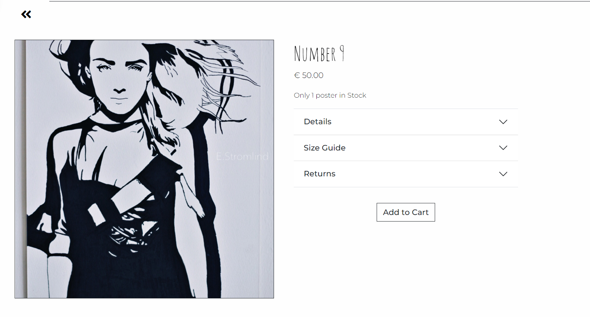
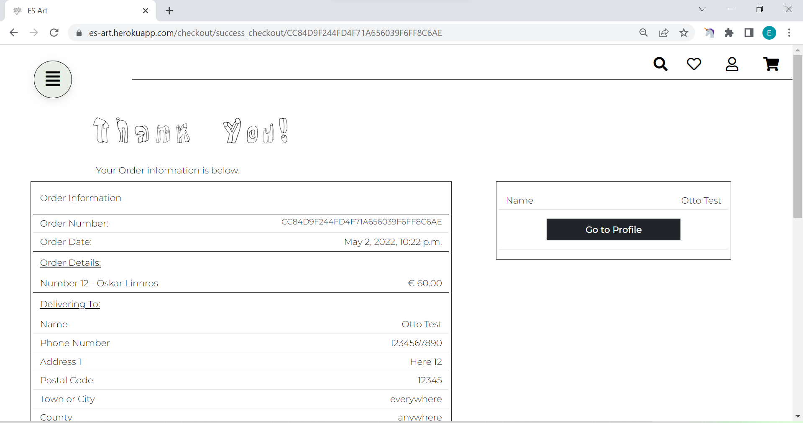

# E.Stromlind Art (ESART)


ES Art is the name of the web application for E.Strömlind art & posters. 
E.Strömlind takes the colorful and vibrant moments in life and makes them abstract and easy for the eye. The inspiration for the posters comes from different types of photos, like concert pictures, fashion editorials from magazines, or random everyday life pictures. All the posters are handmade on acrylic paper, drawn with pen and different types of markers.
This web application exists to display and get the customer a view and an easy way to purchase posters directly or make a request. 
Note: The creator of this web application is the owner of all the images used.

## User Stories

* As a Shopper, I want to get an overview of all the products.
* As a Shopper, I want to be able to see poster all the posters depending on the poster's motive.
* As a Shopper, I want to be able to view a product detail for each product on the page. 
* As a Shopper, I want to be able to like different posters/products and see them on my user page.
* As a Shopper, I want to be able to request a customized poster.
* As a Shopper, I want to be able to create a user profile page for smoother checkouts and be able to edit information when needed.
* As a Shopper, I want to be able to see my order history on my user page.
* As a Shopper, I want to be able to manage the shopping cart by adding, editing, and deleting products in the bag.
* As a Shopper, I want to get confirmation that it went through after purchase.
* As a Shopper, if something goes wrong during the shopping process, I want to get a notification about it.
* As a Store Manager, I want to be able to manage products through the admin page.

## UX
The website design is minimalistic, focusing on the main product, handmade posters. The typography and colors' main point is to create an atmosphere that gives the user a feeling of being in the drawing process of the posters. 

### SEO and Keywords
The keyword research process begins with browsing through other web applications and shops that sell posters. After going through many web applications, brainstorming begins for general topics that would fit the content and purpose of the website.
Some of the web applications from the research process:
* [Wall og Art](https://wallofart.com/)
* [Postery](https://www.postery.com/se/)
* [Poster Store](https://posterstore.se/)
* [Papertown](https://papertown.se/)
* [pstr Studio](https://www.pstrstudio.com/)
* [The Poster Club](https://theposterclub.com/)
* [Artsy Fartsy](https://artsyfartsy.se/)

* Topics: 
  * Print
  * Art
  * Posters
  * Home decoration
  * Wall decoration
  * Painting
  * housewarming gifts

Chosen Topics for this project are: 
* Art 
* Wall decoration
* Painting

* Keywords:
  * Art: posters, print, black and white, handmade, design, artist, painter
  * Wall decoration: frames, home decoration, homestyle, create a wall with art
  * Painting: Print, photography, poster, on the wall, meaning, exclusive 

The web application users and potential customers get identified by answering the following question from the web marketing lessons via Code Institute.
* Who are your users?
A person who has an interest in art, interior design, and home decore 
Someone who wants an easy way to make changes to their home
Someone who wants to give a unique gift to someone 

* Which online platforms would you find lots of your users on? Would your users use social media? If yes, which platforms do you think you would find them on?
Yes, they will be on social media to get inspiration, and some of them may use social media to shop directly. 
  * Instagram
  * Facebook
  * Pinterest
  * TikTok(Unsure, in need to get more information about the customer before deciding)

* What do your users need? Could you meet that need with useful content? If yes, how could you best deliver that content to them?
They need a site that gives the users inspirational content on how they could use the posters. They could mix and match more posters from the site and get a unique portrait of them or other family members or friends. Get ideas for gifts for someone, like a home warming gift.

* Would your business run sales or offer discounts? How do you think your users would most like to hear about these offers?
Yes, the business would offer some sales maybe once or twice a year. There would not be many sales occasions or discounts to make it unique and align with the business concept. If it is unique and gives the customer what they are after, they will buy it at a price offered.

* What are the goals of your business? Which marketing strategies would offer the best ways to meet those goals?
The goal is to create unique and personal art for people to create a private atmosphere at home or for someone to give as a personal gift to someone. 
Social media channels will be at the center of this to achieve this. Create content like creating your picture wall or how a customer could use the art instead of photos.

* Would your business have a budget to spend on advertising? Or would it need to work with free or low-cost options to market itself?
From the start, it would need to do a lot of free or low-cost options in marketing because it is a small independent business focusing on personal art.

#### Facebook page 
The Facebook page is a mock-up created with [Canva](https://www.canva.com/) using the Code Institutes template.


### Colour Scheme
The website's primary colors are:
* Black (#000001) Note: If not Bootstrap5 class text-balck or dark used.
* Cultured white (#FEFEFE)
* Light green color (#E9EFE7)
* Red (#FF0000)


[Coolors.co](https://coolors.co/000001-fefefe-e9efe7-ff0000) to create the color pallet for the project. The green and white colors give the web application a soft and minimalistic feel to highlight the contrasts of the posters and the logo's diamond edges.
The red color highlights errors or messages to catch the user's attention.
The black color is to connect and contrast the primary colors of the posters. 


### Typography
#### Fonts
The fonts for this project comes from [Google fonts](https://fonts.google.com/), and are the following ones:
* [Amatic SC](https://fonts.google.com/specimen/Amatic+SC?query=amatic): for h3 headings and the display of poster names. 
* [Montserrat](https://fonts.google.com/specimen/Montserrat?query=montse): The base font family for the project. Used when no other specifications are said.
* [Rock 3D](https://fonts.google.com/specimen/Rock+3D?query=rock+3): This font is for the h1 and h2 heading.

The use of fonts Amatic SC and Rock 3D gives the web application a feeling of hand-drawn letters and connects it to the shop's core product.

#### Icons
For this project, the different icons for the navbar are:
* [hamburger-menu](https://fontawesome.com/v5/icons/align-justify?s=solid)
* [search](https://fontawesome.com/v5/icons/search?s=solid)
* [heart](https://fontawesome.com/v5/icons/heart?s=regular)
* [user](https://fontawesome.com/v5/icons/user?s=regular)
* [shopping-cart](https://fontawesome.com/v5/icons/shopping-cart?s=solid )

, for the pages, like poster-detail.html are: 
* [heart-regular](https://fontawesome.com/v5/icons/heart?s=regular)
* [heart-solid](https://fontawesome.com/v5/icons/heart?s=solid)
* [arrow-left](https://fontawesome.com/v5/icons/angle-double-left?s=solid)

And for the footer:
* [facebook-icon](https://fontawesome.com/v5/icons/facebook-f?s=brands)
* [instagram-icon](https://fontawesome.com/v5/icons/instagram?s=brands)
* [pinterest-icon](https://fontawesome.com/v5/icons/pinterest-square?s=brands)

### Wireframes

#### Mobile


## Features
### Existing Features
#### Navbar: 


The web application contains a two-part navbar at the top of the pages: An offcanvas menu that the user access by clicking on the round button at the top left corner and a row with icons at the top right corner of the page. 
* Offcanvas menu: 
When a user accesses the offcanvas menu, it opens up on the left side of the page, displaying a list of navigation options. From the options a user can navigate to the:
  * Home page
  * Sign in/Sign Up if the user is not authenticated 
  * My Profile page and Sign Out if the user is authenticated
  * All Posters page 
  * Request customized Poster form 
  * Posters by Categories with a dropdown function displaying all the different categories

  

  

  

  

* Icon visible menu:
The icons on the right side of the navbar give the user easy access to:
  * A search bar where the user can search with different words to find if what they are after is available on the web application.
  * If the user is authenticated, the heart icon will take the user to the page where the user can view all the posters they have provided a 'like' to different posters.
  * If the user is authenticated, the person icon will take the user to the page where the user can view the profile page.
  * The shopping cart, takes the user to the page of the shopping cart.

  

  

  

#### Create an account and login as created user
A user can create a personal account for the web application. The created account is saved for the user to use whenever they like to log in and will make the shopping experience easier and smoother.


#### Messages: 
Depending on if the user does different actions on the web application, a little message box pop-ups at the right top corner of the page. The different messages that can a user can encounter are: 
* Success message for Signing Up to the web application, logging in to it or signing out.


* Success message for adding a product to the cart displays the total amount in the shopping cart, and if it's under the free delivery threshold, tell the user how much is left to shop for to get free delivery.


* Success message if the user removes an item from the shopping cart.


* Success message if the user signs up for the newsletter.


* Success message if the user updates delivery information


* Error message if the user tries to search for something on the web application, but the input is not a valid one.


* Error message if the user tries to add a poster already in the shopping cart.


* Error message if the user tries to sign up for the newsletter service with an existing email.


* Error message if the user tries to go to checkout with no products in the shopping cart


#### Request Poster Form: 
A user can fill out a form on the index page with a request to get a customized poster. The form contains five input fields: 
* Full name: the name of the person making the request
* Email: the email address of the person making the request
* Phone number: phone number of the person making the request
* Description of desired poster design: The person making the request can give relevant information about what they want the poster to look like, size, canvas, etc. 
* Image: for the user to send a photo of the motive to complete the request.
The Full name, email, Phone number and Description fields are required. Those are the information needed to contact the person about the request and start a dialog.


#### Sign Up for newsletters:
A user can sign up for a newsletter by applying their email to the form.


#### Footer:
The Footer gives the user access to the following features:
* About Us: Takes the user to a page about what the company on the web application does. 
* Posters: Takes the user to the shopping page for all the available posters to shop. 
* Terms and Conditions: Takes the user to the page about the shop's terms and conditions to a buyer. 
* Privacy Policy: Takes the user to the page about who and what privacy policy the web applications have. The Privacy policy opens up in a new tab on the web browser. 
* Send email to e.stromlind:  When a user clicks on the email address displayed, it will open the user's nearest email application function with a new email and a set subject of the email. 
* Access Social Media platforms: The web application has three social media icons in the footer that take them to the given social media platform when a user clicks on it. The link will open in a new tab.


#### View all the Posters: 
A user can see all the available posters in the shop on a designated page for it. It shows the poster's image, name, and what each poster costs in EUR.


#### View Posters by category: 
A user can browse through posters in a given category.


#### View a Poster in detail:
The web application gives the user access to details about each poster available in the store. The user sees a bigger image of the poster, its name, the price, add to cart button, and a heart button on this page. The page also provides an accordion with the details, size guide, and return information. The detail contains information about the motive, the size of the poster, and what kind of canvas it's made on. The size guide gives the user information about the sizes in measurements. 
The return information tab gives the user the most important part about the return policy and links to the terms and conditions page.




#### Like a Poster for saving for later or collect them to review:
A user who is authenticated can like/heart posters as a reserve for later functionality. The function makes it easy for the user to track the kind of style of a poster they are after.


#### Add To Cart: 
The add to cart button allows the user to add a poster to the cart. The button only allows the user to add one of the same posters to the cart as the posters are one of a kind. If a user tries to add the same poster twice, they will get a notification saying that the poster already exists in the shopping cart.


#### View shopping cart: 
A user can access the shopping cart page anytime during their time spent at the web application. If there are no posters in the shopping cart, they see a message saying that the shopping cart is currently empty. Have the user add posters to the shopping cart; they will be displayed on a table with the information about the poster and the total cost of all the posters together. If the shopping cart contains an unlimited amount under €70, the user gets notified by a red text, letting them know how much more they need to spend to get free delivery. 
From the shopping cart, they can either go to check out or back to the all poster page to browser some more.


#### Remove poster from shopping cart:
If a user wants to update the current shopping cart, they can remove the poster by clicking on the 'x' on the right side of the table. If users remove all the posters in the shopping cart, they will get redirected to the home page.


#### Buy Posters: 
Users can buy posters via a checkout page with stripe card payment.
The user needs to fill out a form about delivery information and card information to go through with a purchase.
A user, if authenticated, can choose to save the delivery information for later purchases in the future. 
When a purchase has gone through, the user gets redirected to a success page with the order information and an option to go to their profile page to see order history or saved information if they have chosen to save delivery information during purchase.




#### Save information regarding shipping/delivery and update:
A user who is authenticated can, during the buying process, choose if they want to save the delivery information to their profile for future purchases. On their profile page, the user can prefill the delivery information form to update it before or after the purchase with the delivery information if it has changed since the last purchase.


#### See order history made by the user, if authenticated:
On the profile page of an authenticated user, all the orders made by the user shows in an order history table. The user can click on the order number to get all the specific order information about that order.


### Features Left to Implement

* A feature left to implement for the future would be to wire up the application to Amazon AWS3 and create a front-end feature to add new posters to the shop and website.

* The usage of white noise for this project makes the attached images with the request form not get stored in the database. The next step is to set up the project to an image storage database, like Cloudinary or Amazon AWS3 service.

* Add the Like button and add to cart button on the poster page for each poster to give the users a smoother shopping and user experience.

* Add Single sign-on with social accounts for the users to easily create and access purchases and a user profile.

* Add the functionality for users to be able to delete their registered accounts.

## Technologies Used
These are the following technologies and packages used to develop this project:

* [HTML](https://html.spec.whatwg.org/): HTML5 are used to build the core structure of the web application.

* [CSS](https://www.w3.org/TR/css/): CSS is used to style the web application with colors, fonts, placement of elements, etc.

* [JavaScript](https://www.javascript.com/): JavaScript are used to make the web application more interactive for the User.

* [jQuery](https://releases.jquery.com/): jQuery is a fast, small, and feature-rich JavaScript library to make the web application more interactive for the User.

* [Python](https://www.python.org/): Python is used to build the core structure and code for the project.

* [Heroku](https://www.heroku.com/home): Heroku is the deployment environment used to deploy the project and connected with the GitHub repository.

* [Gitpod](https://gitpod.io/): Gitpod is the development environment used for developing all the code during this project.

* [GitHub](https://github.com/): GitHub are used to store the repository for this project.

* [Git](https://atlassian.com/git/): Git is used to create backups of the project and ensure that all versions of the project is pushed to GitHub.

* [Canva](https://www.canva.com/): Canva is a web application used to create the wireframes for this project.

* [Bootstrap5](https://www.getbootstrap.com/): Bootstrap is a front-end open source toolkit to quickly design and customize responsive mobile-first web application. Bootstrap5 is used to create the base for all the templates in the project.

* [DevTools](https://developer.chrome.com/docs/devtools/): Dev Tools is used to look over the development of the website, debugging problems, and try different approaches to issues that would occur during the process. 

* [Auto Prefixer](https://autoprefixer.github.io/): Auto Prefixer is an application used at the end of the project to give the CSS code some extra properties when used on different browsers.

* [Django Framework](https://www.djangoproject.com/): Django is a free and open source Python web framework for rapid development and clean, pragmatic design. Django is used as the base framework for this project.

* [Xml-stipemap](https://www.xml-sitemaps.com/details-es-art.herokuapp.com-49daa557a.html): To create a sitemap for the deployed web application and generate a way for the 'SEO spiders' to crawl on the pages of the web application.

### Django packages
To build this project the following packages needs to be installed:
<details><summary>CLICK HERE to expand the full requirements.txt file details</summary>

| Package  | Version | Description |
| ------------- | ------------- | ------------- |
| [Django](https://www.djangoproject.com/) | 3.2 | The Django Framework|
| dj_database_url | 0.5.0 | Utilizes the 12factor inspired DATABASE_URL environment variable to configure Django apps  |
| [Django-allauth](https://django-allauth.readthedocs.io/en/latest/) | 0.48.0 | An integrated Django application for addressing authentication, registration, account management, and social account authentication. |
| [django-countries==7.2.1](https://pypi.org/project/django-countries/) | 2.9.3 | A Django application that provides country choices for use with forms, flag icons static files, and a country field for models (Text from website). |
| [django-crispy-forms==1.14.0](https://django-crispy-forms.readthedocs.io/en/latest/) | 2.9.3 | A way to control the rendering behavior of your Django forms in a very elegant and DRY way. |
| [Gunicorn](https://gunicorn.org/)  | 20.1.0 | Gunicorn is a Python WSGI HTTP Server for UNIX. It's a pre-fork worker model. The server is compatible with various web frameworks and light in server resources |
| [Pillow](https://pillow.readthedocs.io/en/stable/) | 9.1.0 | Pillow is a Python Imaging Library that adds image processing capabilities to the Python interpreter. |
| [Psycopg2](https://www.psycopg.org/docs/) | 2.9.3 | A PostgreSQL database adapter for the Python programming language |
| [stripe==2.74.0](https://stripe.com/se) | 2.9.3 | A workframe to bring together everything needed to build websites and apps that can receive and send payments worldwide.  |
| [Whitenoise](https://whitenoise.evans.io/en/stable/django.html) | 6.0.0 | Whitenoise allows the web app to serve its own static files |


The [requirements.txt](requirements.txt) command for the installed packages is:
- `pip3 install -r requirements.txt`

</details>

### Models
These are the models made for this project.

#### checkout app models
```python
<import uuid

from django.db import models
from django.db.models import Sum
from django.conf import settings

from django_countries.fields import CountryField

from posters.models import Poster
from customers.models import Customer


class Order(models.Model):
    """
    The model handling Orders
    """
    order_number = models.CharField(max_length=32, null=False, editable=False)
    customer_info = models.ForeignKey(
        Customer,
        on_delete=models.SET_NULL,
        null=True,
        blank=True,
        related_name='orders'
    )
    full_name = models.CharField(max_length=70, null=False, blank=False)
    email = models.EmailField(max_length=200, null=False, blank=False)
    phone_number = models.CharField(max_length=20, null=False, blank=False)
    street_address1 = models.CharField(max_length=80, null=False, blank=False)
    street_address2 = models.CharField(max_length=80, null=True, blank=True)
    postcode = models.CharField(max_length=10, null=True, blank=True)
    county = models.CharField(max_length=80, null=True, blank=True)
    town_or_city = models.CharField(max_length=85, null=False, blank=False)
    country = CountryField(
        blank_label='(Select Country)',
        null=False,
        blank=False
    )
    date = models.DateTimeField(auto_now_add=True)
    delivery_cost = models.DecimalField(
        max_digits=6, decimal_places=2,
        null=False, default=0
    )
    order_total = models.DecimalField(
        max_digits=10,
        decimal_places=2,
        null=False,
        default=0
    )
    total_cost = models.DecimalField(
        max_digits=10,
        decimal_places=2,
        null=False,
        default=0
    )

    def _generate_order_number(self):
        """
        Generate a random, unique order number using UUID
        Code from Boutique Ado
        """
        return uuid.uuid4().hex.upper()

    def update_total(self):
        """
        Update grand total each time a line item is added,
        accounting for delivery costs.
        Codebase from Boutique Ado
        """
        self.order_total = self.lineitems.aggregate(
            Sum('lineitem_total'))['lineitem_total__sum'] or 0
        if self.order_total < settings.FREE_DELIVERY_THRESHOLD:
            self.delivery_cost = settings.STANDARD_DELIVERY_COST
        else:
            self.delivery_cost = 0
        self.total_cost = self.order_total + self.delivery_cost
        self.save()

    def save(self, *args, **kwargs):
        """
        Override the original save method to set the order number
        if it hasn't been set already.
        Code from Boutique Ado
        """
        if not self.order_number:
            self.order_number = self._generate_order_number()
        super().save(*args, **kwargs)

    def __str__(self):
        return self.order_number


class OrderLineItem(models.Model):
    """
    Model for each line of the order
    """
    order = models.ForeignKey(
        Order,
        null=False,
        blank=False,
        on_delete=models.CASCADE,
        related_name='lineitems'
    )
    poster = models.ForeignKey(
        Poster,
        null=False,
        blank=False,
        on_delete=models.CASCADE
    )
    quantity = models.IntegerField(null=False, blank=False, default=0)
    lineitem_total = models.DecimalField(
        max_digits=6,
        decimal_places=2,
        null=False,
        blank=False,
        editable=False
    )

    def save(self, *args, **kwargs):
        """
        Override the original save method to set the lineitem total
        and update the order total.
        """
        self.lineitem_total = self.poster.price * self.quantity
        super().save(*args, **kwargs)

    def __str__(self):
        return f'Name {self.poster.name} on order {self.order.order_number}'
>
```

####  customers app models
```python
<from django.db import models
from django.contrib.auth.models import User
from django.db.models.signals import post_save
from django.dispatch import receiver

from django_countries.fields import CountryField


class Customer(models.Model):
    """
    A model for maintaining default delivery information and
    order history for registered customers
    """
    customer = models.OneToOneField(User, on_delete=models.CASCADE)
    defualt_email = models.EmailField(
        max_length=200,
        null=True,
        blank=True
    )
    default_phone_number = models.CharField(
        max_length=20,
        null=True,
        blank=True
    )
    default_street_address1 = models.CharField(
        max_length=80,
        null=True,
        blank=True
    )
    default_street_address2 = models.CharField(
        max_length=80,
        null=True,
        blank=True
    )
    default_postcode = models.CharField(
        max_length=10,
        null=True,
        blank=True
    )
    default_county = models.CharField(
        max_length=80,
        null=True,
        blank=True
    )
    default_town_or_city = models.CharField(
        max_length=85,
        null=True,
        blank=True
    )
    default_country = CountryField(
        blank_label='(Select Country)',
        null=True,
        blank=True
    )

    def __str__(self):
        return self.customer.username


@receiver(post_save, sender=User)
def create_or_update_customer_info(sender, instance, created, **kwargs):
    """
    A function to create or update the user profile
    """
    if created:
        Customer.objects.create(customer=instance)

    instance.customer.save()
>
```

#### home app models
```python
<from django.db import models


class NewsletterSubscriber(models.Model):
    """
    A model to collect email for Newsletter
    subcriptions
    """
    news_email = models.EmailField()
    subscribe_date = models.DateTimeField(auto_now_add=True)

    def __str__(self):
        return self.news_email


class RequestPoster(models.Model):
    """
    The model to take request for customized Posters
    """
    full_name = models.CharField(max_length=70, null=False, blank=False)
    email = models.EmailField(max_length=200, null=False, blank=False)
    phone_number = models.CharField(max_length=20, null=False, blank=False)
    date = models.DateTimeField(auto_now_add=True)
    motive = models.CharField(max_length=500, null=False, blank=False)
    image = models.ImageField(null=True, blank=True)

    def __str__(self):
        return self.full_name
>
```

#### posters app models
```python
<from django.db import models
from django.contrib.auth.models import User


class Motive(models.Model):
    """ The model for motives / Categories """

    name = models.CharField(max_length=200)
    friendly_name = models.CharField(max_length=200, null=True, blank=True)

    class Meta:
        """ Defines the model name in plural """
        verbose_name_plural = 'Motives'

    def __str__(self):
        return self.name

    def get_friendly_name(self):
        """ Returns the friendly name of a motive """
        return self.friendly_name


class Poster(models.Model):
    """ The model for the Poster product """
    name = models.CharField(max_length=200)
    motive = models.ForeignKey(
        'Motive', null=True, blank=True, on_delete=models.SET_NULL)
    description = models.TextField()
    size = models.BooleanField(default=False, null=True, blank=True)
    quantity = models.IntegerField(default=0)
    price = models.DecimalField(max_digits=7, decimal_places=2)
    image = models.CharField(max_length=100, null=True, blank=True)
    like = models.ManyToManyField(
        User, related_name='poster_like', blank=True)

    def __str__(self):
        return self.name
>
```

## Testing
To view all tests for this project, please refer to the [TESTING.md](TESTING.md) file.

## Deployment
The site was deployed to Heroku. The steps to deploy are as follows:
* Go to the [Heroku](https://www.heroku.com/home) site, [sign up](https://signup.heroku.com/login) for free if you do not already have an account.
    * If creating an account, fill in the signup form with name.
* On the dashboard page, navigate to the Create New App button and click.
* Give the app a unique name; it can not have the same name as another app, choose the region you are currently located in and select Create app.
* Go to the Resources tab and select add a database. In the add-ons box, search for Postgres. Select Heroku Postgres and click Submit Order Form.
* On the apps dashboard page, navigate to the Settings tab.
* On the Settings page, go down to the config vars section. 
* Create the following config vars:
  * Set the key to `DATABASE_URL`, value to `Provided-postgres-link`, and click add. 
  * Set the key to `SECRET_KEY`, value to `Your-SECRET_KEY`, and click add. 
  * Set the key to `DEBUG`, value to `True`, and click add. 
  * Set the key to `DISABLE_COLLECTSTATIC`, value to `1`, and click add.
  * Set the key to `STRIPE_PUBLIC_KEY`, value to `Your-STRIPE_PUBLIC_KEY_API`, and click add.
  * Set the key to `CLIENT_SECRET`, value to `Your-STRIPE_SECRET_KEY_API`, and click add.

Note: Remove DEBUG and DISABLE_COLLECTSTATIC before the final deployment. Also remember to have the env.py file in the **.gitignore** file before the first deployment. So no value information will be visible after deployment.

* To obtain a Stripe key (For this project Stripe is set in Test mode)
  * Go to the [Stripe](https://www.stripe.com/home) site, [sign up](https://dashboard.stripe.com/register) for free if you do not already have an account. 
    * If creating an account, fill in the signup form with email, name, country and password.
  * On the dashboard page, navigate to the Developer button and click. Make sure that the test-mode is on.
  * On the Developer menu, navigate to the API-Keys button and click.
  * Retrive the Publishable key api code.
  * Retrive the Secret Key API by clicking on the reveal Test Key.
    * Make sure that the API keys begins with 'pk_test_...' and 'sk_test_...'.

Note: Remember to have the env.py file and have it in the **.gitignore** file before the first deployment. So no value information will be visible after deployment. Add the Stripes API Keys to the env.py file and set the variables from the env.py file in the settings.py file. 

* To obtain a PostgreSQL DATABASE_URL 
  * Install the supporting libraries by typing in the command 'pip3 install dj_database_url pyscopg2'
  * When done, type in the command `pip3 freeze --local > requirements.txt` in the terminal
  * In the env.py file, import os. 
  *  Setup the following environment variable: 
      DATABASE_URL and paste in the DATABASE_URL from Heroku.
      ```os.environ['DATABASE_URL'] = 'postgres://***************'```

  * In the settings.py file, import os dj_database_url.
    So scroll down to the DATABASES section and comment out the entire section. 
    Below the comment out section, add in the following code: 
    ```DATABASES = {'default': dj_database_url.parse(os.environ.get('DATABASE_URL'))}```

* Navigate to the Deploy tab and down to the section called Deployment method. 
* Select GitHub and confirm the connection between Heroku and GitHub.
* Search for the project's repository name on GitHub and click "connect" to link GitHub with Heroku.
* On the same page, scroll down and choose how to deploy the app. For this project, automatic deploys are selected and enabled.
* Create a **Procfile** for Heroku, inside the file insert the following line:
    - `web: gunicorn cosmos.wsgi`
    * Note that cosmos is the name for this app.
    
* Create a **requirements.txt** file for Heroku, using the following command:
    - `pip3 freeze --local > requirements.txt`

The live link can be found here - [https://es-art.herokuapp.com/](https://es-art.herokuapp.com/)

### Local Deployment
In order to make a local copy of this project, you can type the following into your IDE Terminal to clone this repository:

- `git clone https://github.com/stroemlind/esart.git`

Alternatively, if using Gitpod, you can click below to create your own workspace using this repository.

[](https://gitpod.io/#https://github.com/stroemlind/esart)
## Credits
### Content
Color choose: 
[Coolors.co](https://coolors.co/)

Fonts:
[Google fonts](https://fonts.google.com/)

Icons:
[FontAwesome](https://fontawesome.com/)

List in footer for icons:
[Unused-css](https://unused-css.com/blog/css-horizontal-lists/)

Secret Key generator:
[Miniwebtool](https://miniwebtool.com/django-secret-key-generator/)

Round Menu Button:
[W3school](https://www.w3schools.com/howto/howto_css_round_buttons.asp)

Menu Button:
[Codepen](https://codepen.io/seme332/pen/reJOwo)
[Getcssscan](https://getcssscan.com/css-box-shadow-examples) nr.9
[W3school](https://www.w3schools.com/cssref/tryit.asp?filename=trycss_position2)

White Noise:
[White Noise](http://whitenoise.evans.io/en/stable/index.html)
[Devcenter](https://devcenter.heroku.com/articles/django-assets)

mobile wireframe base:
[imockups](https://imockups.com/iphone-xs-wireframe-template_3884)

Canva for wireframe design:
[Canva](https://www.canva.com)

Remove item from cart
[Devdreamz](https://devdreamz.com/question/533451-remove-an-unique-item-from-shopping-cart-in-django)

Django countries:
[Django Countries](https://pypi.org/project/django-countries/)
[Django Countries get countries](https://pypi.org/project/django-countries/#get-the-countries-from-python)

Toasts help:
[Stackoverflow](https://stackoverflow.com/questions/56503954/bootstrap-toast-does-not-show-up)

Newsletter:
[YouTube](https://www.youtube.com/watch?v=TBVsILIt4HM&list=PLGzru6ACxEAKtb29AeyHbVGUh2-0r891H&index=20) Video 20 - 26.
[Stackoverflow](https://stackoverflow.com/questions/66371279/how-to-create-a-simple-form-in-the-base-html-template-django)

Request form image:
[GeeksforGeeks](https://www.geeksforgeeks.org/imagefield-django-forms/)

Stripe
[Stripe Card](https://stripe.com/docs/payments/cards/overview)
[Stripe Elements](https://stripe.com/docs/payments/elements)
[Stripe Create Payment Element](https://stripe.com/docs/js/elements_object/create_payment_element)
[Stripe JS Docs](https://stripe.com/docs/js)
[Stripe Testing](https://stripe.com/docs/testing)

Customer like page
[Stackoverflow](https://stackoverflow.com/questions/63547411/django-filter-liked-posts-by-user )

jQuery for index request poster form:
[jQuery](https://api.jquery.com/submit/ )

Bootstrap:
[Bootstarp5](https://https://getbootstrap.com/docs/5.1/getting-started/introduction/)

Footer at bottom:
[Radu](https://radu.link/make-footer-stay-bottom-page-bootstrap/)

[Send Email](https://www.youtube.com/watch?v=1BaLWYUO1k4)

### Media
All the images displayed to the user are made and ownd by the creator of this project.

### Acknowledgements (edited) 
