# Testing
There was always a tab open for testing with the website preview through Gitpod port 8000. To check up on my code and see if it worked as I wanted. I used DevTools to see how the code would respond if I added or changed properties or values with CSS or Bootstrap. I also took help from DevTools to check the responsiveness when decreasing or increasing the screen size. To see and test the website's performance, I used Lighthouse, for both mobile and desktop usage, which gave me an updated report to see how well my performance, accessibility, and SEO were for the website.

To see that the JavaScript code in the project worked without any bugs, I used the console section of DevTools to know that it rendered as it should.

Several internet browsers, like Chrome, Mozilla Firefox, Microsoft Edge, and Safari, were used during all the testing. It works on all the mentioned internet browsers and mobile devices.
## Code Validation

### HTML
There are no errors form the offical [W3C Validatior](https://validator.w3.org/)
   

   
    
  Link to the validation for the home page: [W3C Validatior](https://validator.w3.org/nu/?doc=https%3A%2F%2Fes-art.herokuapp.com%2F)

Except for the customer profile page and the liked poster page, which gave an Error 500. See unfixed bugs for more infromation. 

### CSS
There are no major errors form the offical [Jigsaw validator](https://jigsaw.w3.org/css-validator/), except for on the customer and liked poster page, where an error occur. The warning for the valid pages am I aware of.
Note: See Unfixed bugs for more infromation.

  

  

  
    
  Link to the validation: [Jigsaw validator](http://jigsaw.w3.org/css-validator/validator?lang=en&profile=css3svg&uri=https%3A%2F%2Fes-art.herokuapp.com%2F&usermedium=all&vextwarning=&warning=1)

### JavaScript
No errors where found when going through the offical [Jshint validator](https://jshint.com/).
* There are 4 functions in this file.
* Function with the largest signature take 1 arguments, while the median is 1.
* Largest function has 8 statements in it, while the median is 4.5.
* The most complex function has a cyclomatic complexity value of 3 while the median is 1.5.
I am aware of the warning about the Stripe element, but to setup this code I followed the lessons and Strip documentation. Do not cause an issue with the functionality of the code. 

    

### Python
The code passed through [PEP8 linter](http://pep8online.com/). The result confirmed there are no problems with the code.

## Browser Compatibility
### Google Chrome
The website runs without any issues in the Google Chrome browser

  

### Mozilla Firefox
The website runs without any issues in the Mozilla Firefox browser

  

### Microsoft Edge
The website runs without any issues in the Microsoft Edge browser

  

### Safari
The website runs without any issues in the Safari browser

  

## Responsiveness
This section provides images of the tests for responsiveness on different screen sizes.

### Desktop
### Tablet 
### Mobile 

## Tested User Stories
### Overview of all the products.

### See poster all the posters depending on the poster's motive.

### View a product detail for each product on the page.
The user gets a detailed view of the poster. The name, price, stock info, and like button are visible. The accordion works accordingly and displays the given information below each subject. The terms and conditions page button takes the user to the right page.

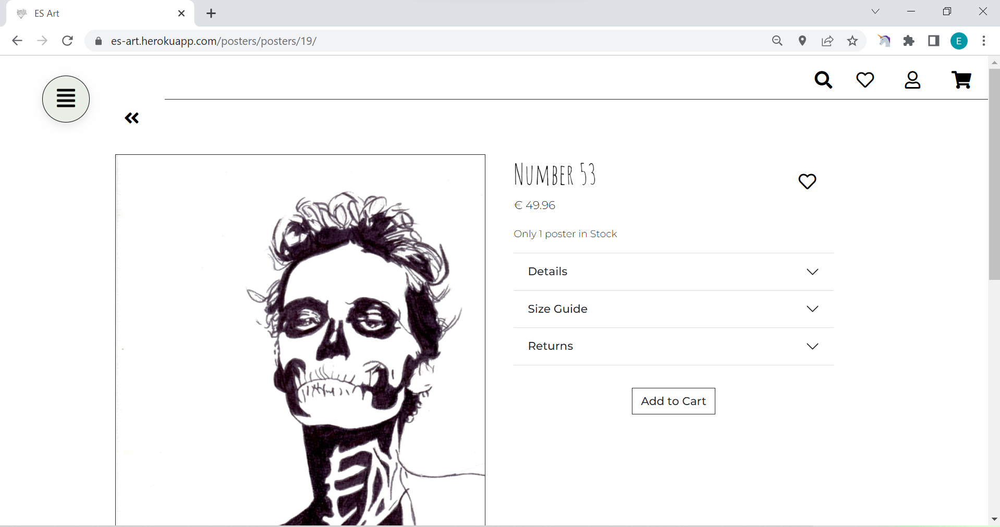

### Like different posters and see them on my user page
An authenticated user can like and unlike the posters through a heart-shaped button. The button works accordingly. 
The user should see the liked poster on a separate page instead of the profile page. If the user is not authenticated, the heart button is not visible on the poster detail page or the navbar.
Unfortunately, the code to render the page is not fully developed yet and has a text with a message about it. Please see the unfixed bugs section.

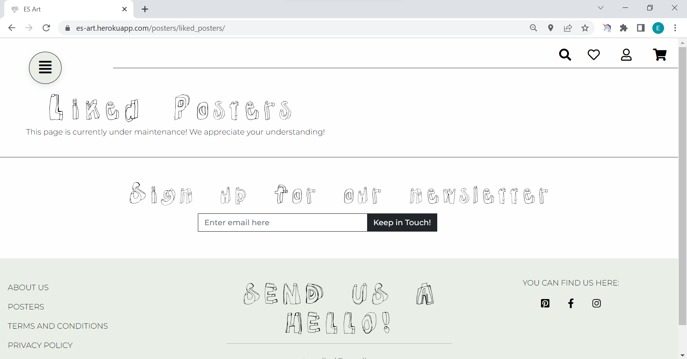

### Request a customized poster.
A user can fill out a form on the index page with a request to get a customized poster. 
The Full name, email, Phone number, and Description fields are required. If a user tries to submit the form with one or more of these fields empty, they get a notification letting them know that the field is required or missing valid characters, for example, the email field. 

Submit form with empty Full Name field 

Submit form with empty Email field or submit email whitout an "@"

Submit form with empty Phone number field

Submit form with empty Description field

Submit form with correct input in fields

Submit form Success message and conformation

Submitted form stored on the Admin page

### Create a user profile page for smoother checkouts and be able to edit information when needed.
#### Sign Up
The sign-up function works accordingly. A user can sign-up with a username, email, and password. The email field is only optional in the user does not want to give it for the sign-up. 
If the user does not provide a valid input or an empty input to the required fields, a message gets displayed, letting the user know why the sign-up process did not go through. The user gets redirected to the home page with a successful sign-up.

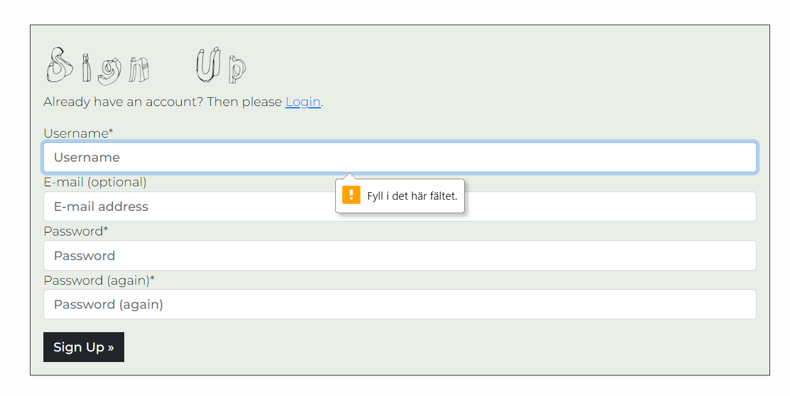

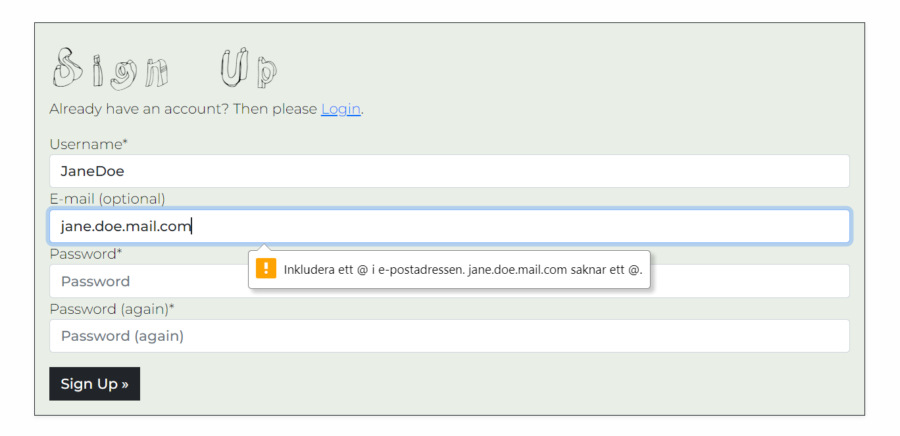

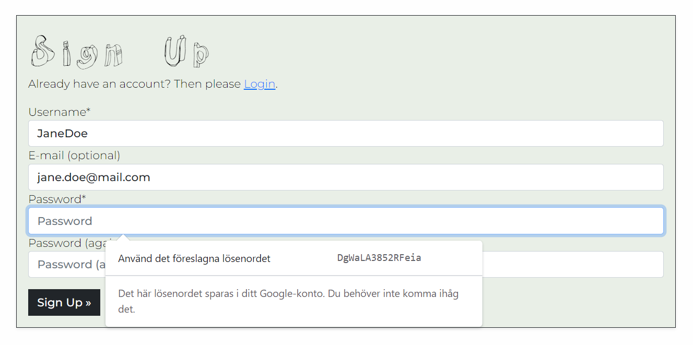

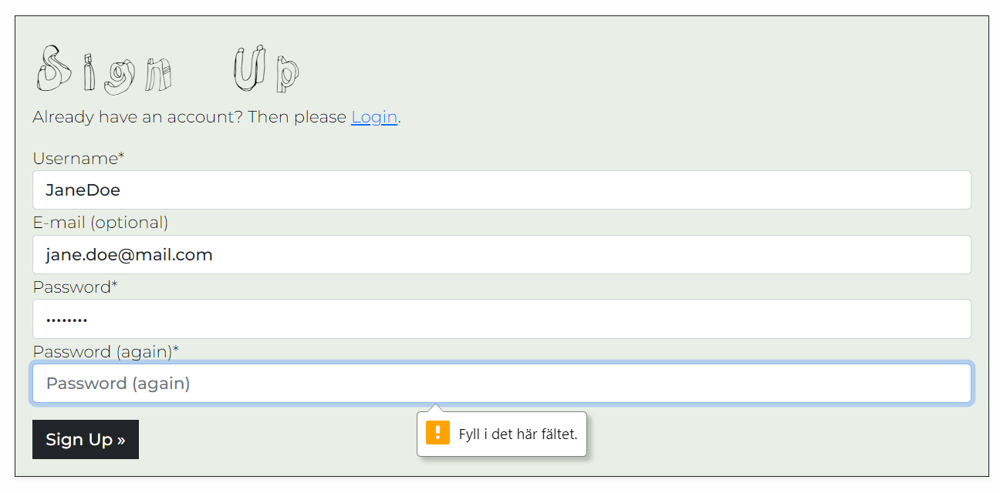

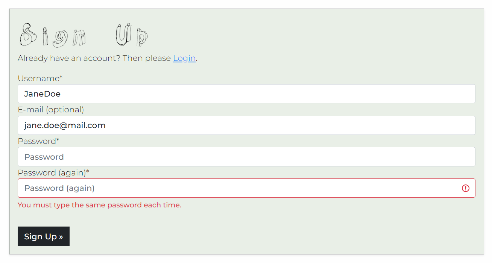

#### Login
The login function works accordingly. A user can log in with given account details from sign up. If the user does not provide a valid input or an empty input to the required fields, a message gets displayed, letting the user know why the login process did not go through. The user gets redirected to the home page with a successful log in.

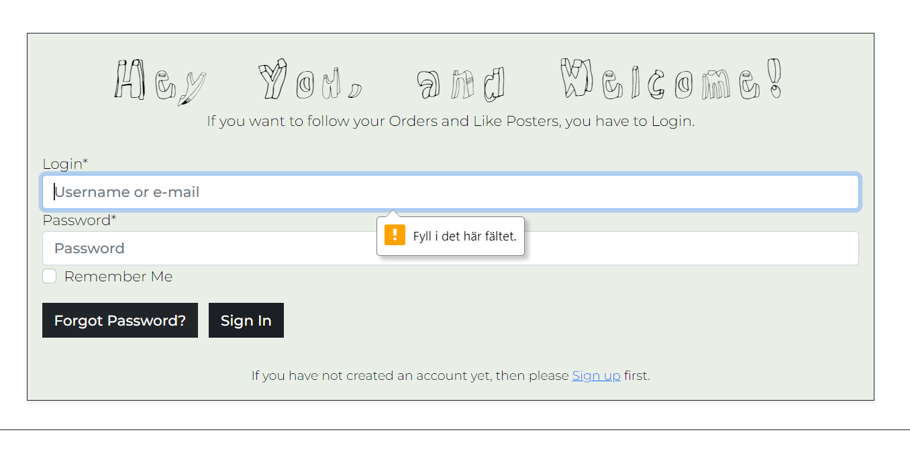

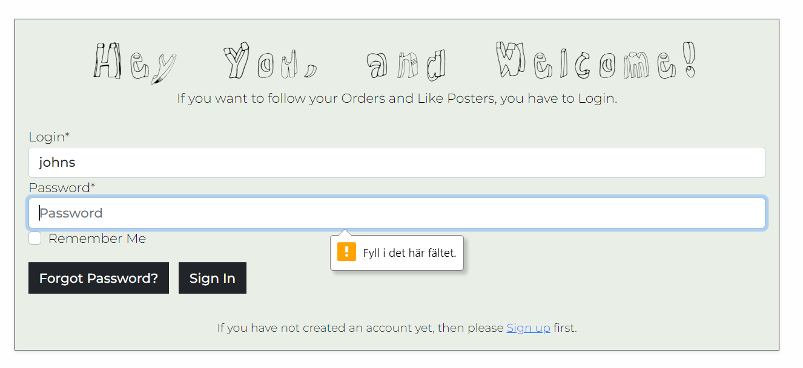

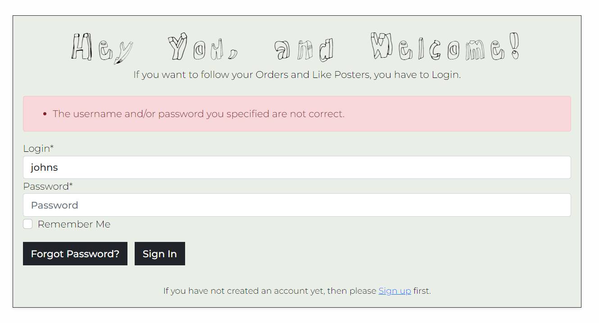

#### Edit Profile information
A user can prefill out the delivery form for purchases or update it after purchase. The information given during the buying process gets saved if the user checks the box for it.

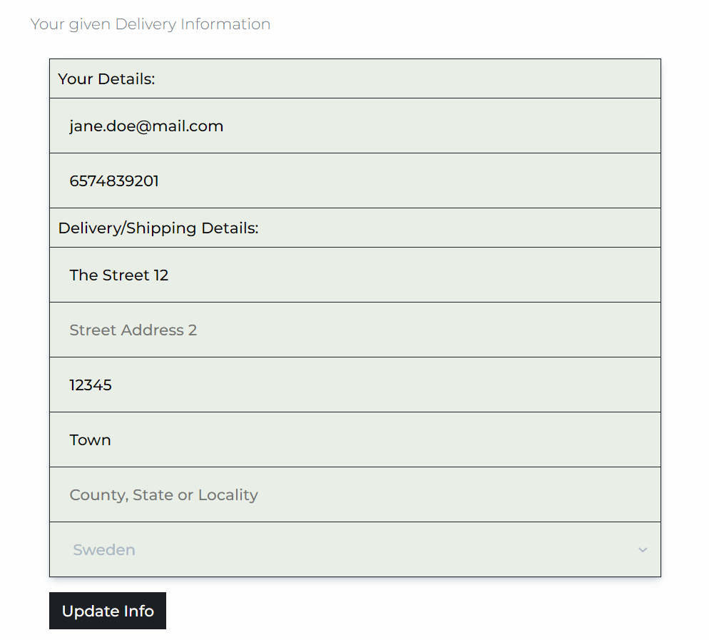

### View order history on my user page
An authenticated user who makes a purchase can view their order history on their designated profile page. When clicking on the order number, it takes the user to a page to view the information about that specific order.

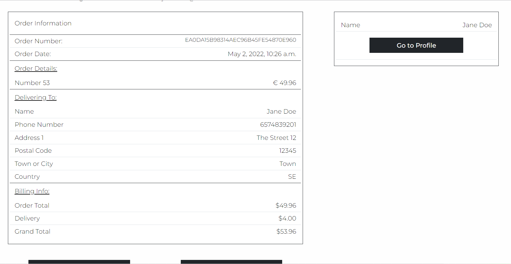

### Manage the shopping cart by adding, editing, and deleting products in the bag.
A user can manage the shopping cart by adding products and removing products to update the cart. When adjusting the shopping cart, the user gets a message of success. There is only one of each poster in stock, and the sizes are the ones given; the user can not update the shopping cart with the size or quantity of the posters.

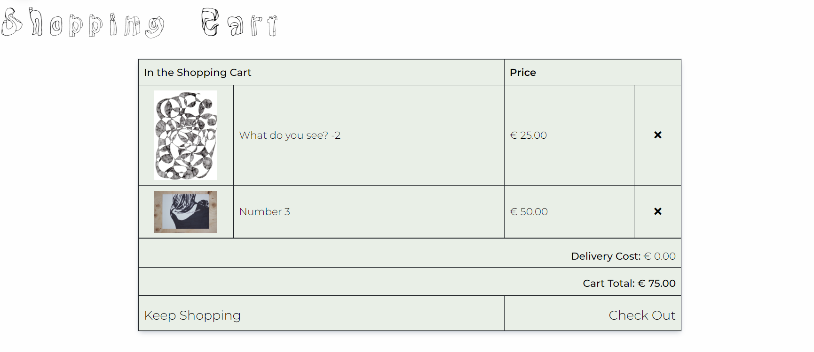

### Confirmation that the payment went through.
After purchase, the user gets confirmation displayed on their browser window with a message and redirected to a success checkout page. Here the user can see the complete order information about the purchase. If the user is an authenticated user for the web application, they can go to their profile page and review the order confirmation.

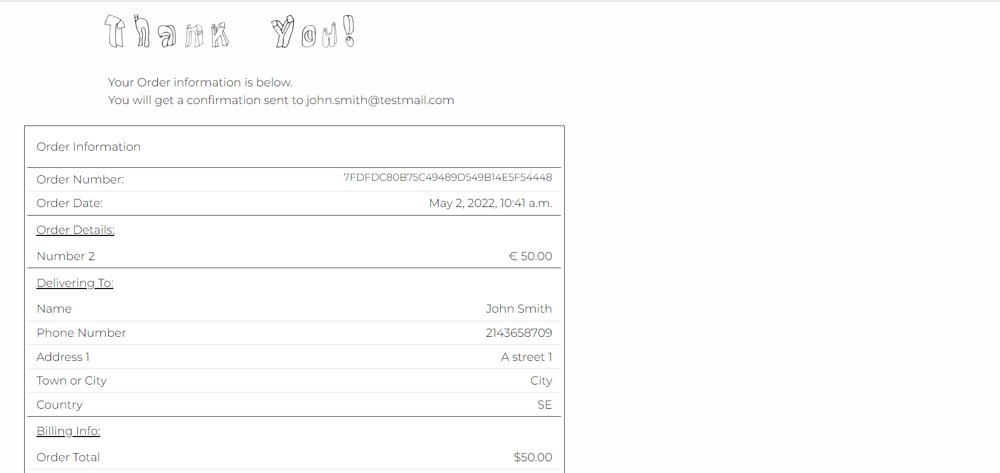

### Something goes wrong during the shopping process, I want to get a notification about it.

### Manage products through the admin page.

## Tested Features
Test existing web application features that are not related to a User Story.

### Menu/Navbar
#### Hidden Menu/Navbar

Home

Login

Sign Up

Profile

Sign out

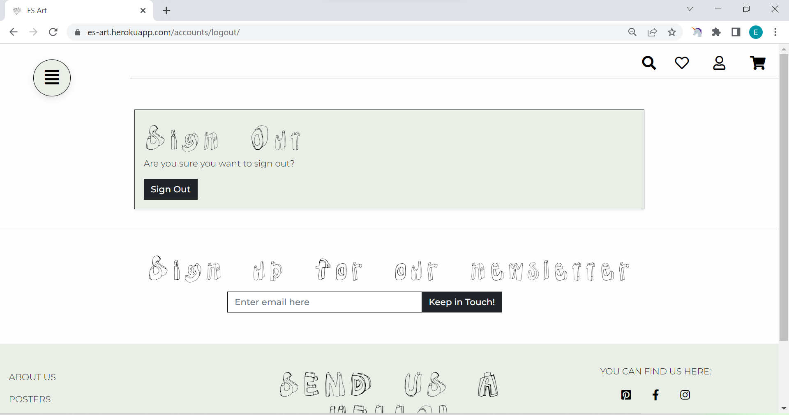

All Posters

Customize/Request Poster

Categories

#### Visable icon Menu/Navbar
Serach bar
The search function works accordingly. If a user tries to search with an empty field or invalid form, an error message appears on their browser window.
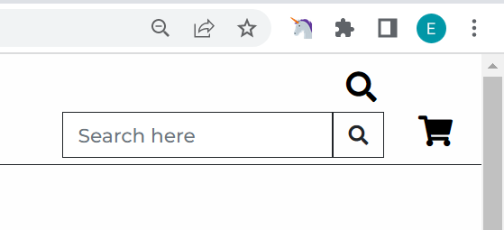

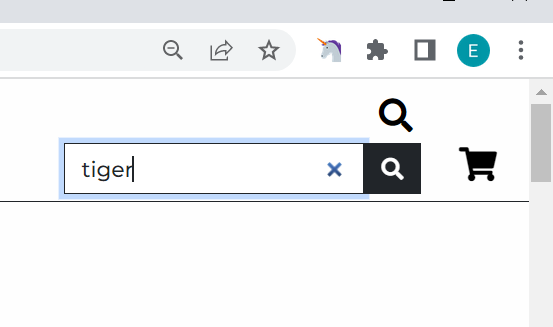

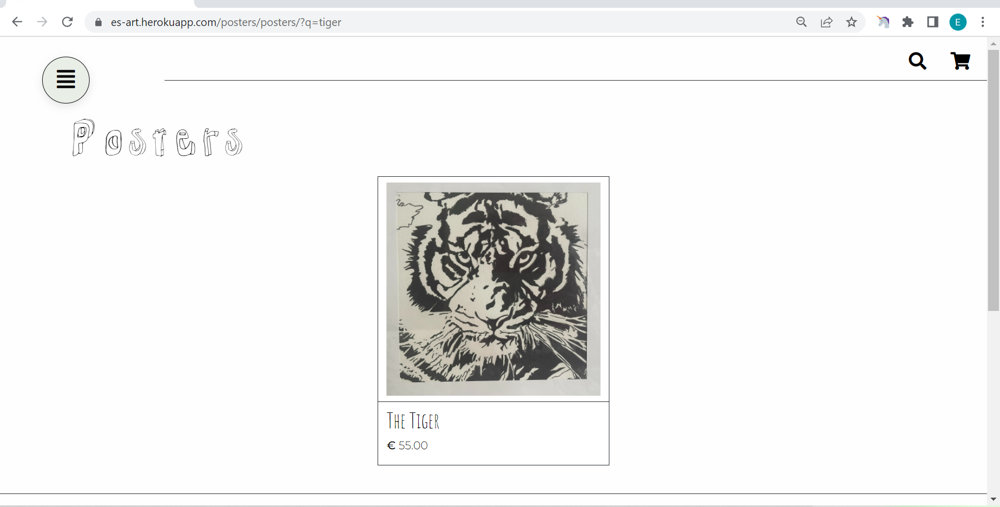

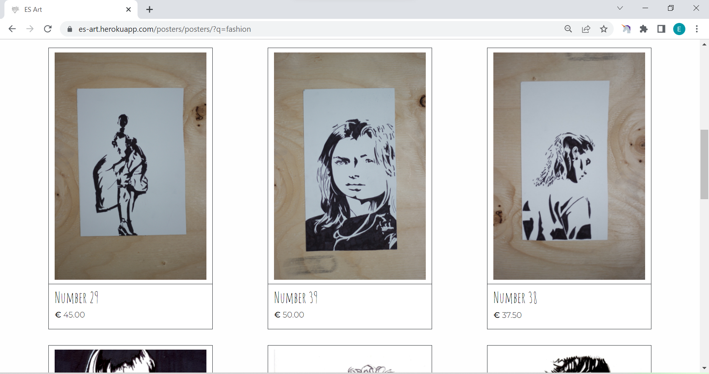

Liked Posters Page

Profile

Shopping Cart

### Footer
The results for testing the existing features in the footer. 

#### Newsletter Sign Up
A user can quickly sign up for a newsletter. The user gets a notification success message displayed on their screen when sign-up is complete.
If the user tries to add an invalid email or an existing email on the subscription list, an error message will be displayed o their screen.

#### About Us page
When users click on the About Us link in the footer, they get redirected to the About Us page.

#### Posters
When users click on the Posters link in the footer, they get redirected to the All Posters page.

#### Terms and Conditions
When users click on the Terms and Conditions link in the footer, they get redirected to the Terms and Conditions page.

#### Privacy Policy
When users click on the Privacy Policy link in the footer, they get redirected to the Privacy Policy page, and it opens up in a new tab in the browser window.

#### Send a hello email
When users send a mail through the Send Us a Hello link, it opens the user's nearest open email source with a subject prefilled. The mail comes to the given email address.

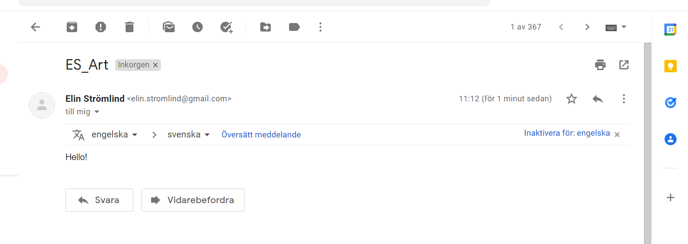
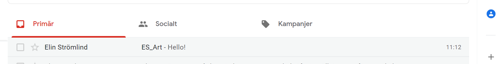

#### Social Media platforms
When users click on one of the Social Media icons in the footer, they get redirected to the given web application. The link opens in a new tab in the browser window.

## Unfixed Bugs
* Remove text from the request Poster Form 

* A bug that I can not figure out how to solve correctly is the Add to cart button not changing when a user adds a poster to the shopping cart. To fix this in the meantime, I implemented an Error message letting the user know that the poster was already in the shopping cart.

* This project took shape with two different computers and screen sizes. Depending on which computer, the d in the heading "E.Stromlind posters and art" disappears into the image to the right. I have lowered the pixel size from 60px to 55px to make it look better on both computers, but it is something to look over in more detail.